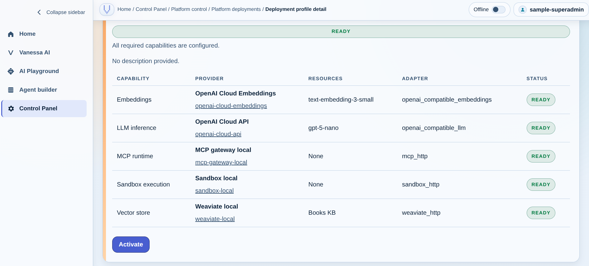
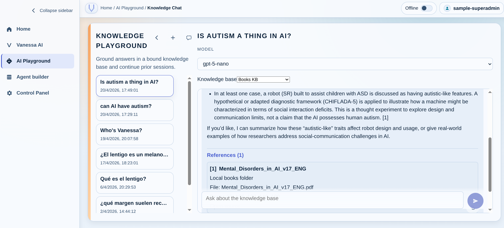

# VANESSA
### Versatile AI Navigator for Enhanced Semantic Search & Automation

[](https://github.com/raul-arrabales/VANESSA/actions/workflows/docs-pages.yml)
[](LICENSE)
[](https://raul-arrabales.github.io/VANESSA/)

VANESSA is a local-first, cloud-capable AI platform for building, operating, and governing AI assistants, tools, and model-serving infrastructure. It combines a backend-owned GenAI control plane, a distinct ModelOps layer, agent/tool orchestration, and a modular multi-service runtime that can run fully locally or mix local and cloud providers.

It is designed for teams that want more than a single chat app: a platform where model lifecycle, tool execution, deployment profiles, runtime policy, and product AI surfaces can evolve cleanly together.

Best for: local AI experimentation, agent and tool orchestration, platform governance, and extensible OSS development.

## Quick Links

- [Quick Start](#quick-start)
- [Why VANESSA](#why-vanessa)
- [System At A Glance](#system-at-a-glance)
- [Documentation](#documentation-map)
- [Local Staging](#local-staging)
- [Contributing](#contributing)
- [Testing](#testing)

## Why VANESSA

- Local-first runtime with optional cloud providers behind a backend-owned control plane
- Explicit `capabilities`, `providers`, and `deployment profiles` for runtime switching and governance
- Separate ModelOps domain for managed model catalog, validation, lifecycle, and sharing
- Agent orchestration with converged tool runtime support for MCP-backed tools and sandboxed Python execution
- Product-facing AI surfaces for playgrounds, builder workflows, catalog administration, and first-party Vanessa behavior
- Modular container topology that stays extensible without collapsing control, runtime, and product concerns into one service

## Experience Snapshot

| Deployment Profiles | Knowledge Chat |
| --- | --- |
|  |  |

## Quick Start

The fastest way to run VANESSA locally is through the local staging workflow:

```bash
git clone https://github.com/raul-arrabales/VANESSA.git
cd VANESSA
./ops/local-staging/start.sh
./ops/local-staging/health.sh
```

Then open:

- Frontend: `http://localhost:3000`
- LLM gateway (when local staging is up): `http://localhost:8000`

For a fuller setup guide, see [docs/setup.md](docs/setup.md) and [ops/local-staging/README.md](ops/local-staging/README.md).

## System At A Glance


VANESSA is organized around a few clear domains:

- Product UI: React/Vite frontend for playgrounds, agent builder, catalog administration, platform control, and Vanessa AI
- Backend / control plane: Flask API that owns auth, orchestration, GenAI control plane, deployment resolution, and ModelOps-facing governance
- Model serving: private `llm` gateway plus split local runtimes for inference and embeddings, with optional `llama_cpp`
- Agent engine: multi-step execution, retrieval, and tool dispatch against backend-resolved `platform_runtime`
- Tool runtimes: optional MCP gateway for remote/general-purpose tools and sandbox for isolated Python execution
- Storage: PostgreSQL for relational state plus Weaviate and optional Qdrant for vector retrieval

For the full architecture narrative and generated diagram source of truth, see [docs/architecture.md](docs/architecture.md).

## Core Concepts

The runtime architecture is intentionally explicit:

- `capability`: a platform function such as `llm_inference`, `embeddings`, `vector_store`, `mcp_runtime`, or `sandbox_execution`
- `provider`: a concrete implementation family for a capability, such as `vllm_local`, `weaviate_local`, `sandbox_local`, or OpenAI-compatible cloud families
- `deployment profile`: the named set of active capability bindings used to resolve a runtime snapshot
- `provider_origin`: backend-owned `local` or `cloud` classification inherited by provider instances and runtime payloads
- `platform_runtime`: the resolved runtime snapshot passed from backend to `agent_engine`

Model lifecycle and access governance live in ModelOps, while active runtime selection lives in the platform control plane.

## Runtime Profiles

VANESSA currently uses global runtime profile semantics for safety gates and provider access:

- `online` allows cloud-capable runtime behavior where configured
- `offline` blocks cloud provider validation, deployment activation, runtime resolution, and invocation before any provider client is created
- MCP-backed web search is governed by the same runtime contract, while sandbox-backed Python execution can remain available offline when the optional capability is bound

## Product Areas

The product-facing AI surface is split into clear domains:

- `AI Playground`: user-facing chat and knowledge workspaces
- `Agent Builder`: builder-facing agent authoring and publish flows
- `Catalog Control`: superadmin management for typed agent and tool definitions
- `Vanessa AI`: first-party Vanessa behavior on top of shared execution seams
- `Platform Control`: provider, deployment, runtime, and capability governance

Canonical product APIs live under `/v1/playgrounds/*` and `/v1/agent-projects/*`, while admin and platform surfaces live under the backend-owned `backend/app/api/http` domain modules.

## Local Staging

The `ops/local-staging/` workflow is the recommended way to validate the full stack on Ubuntu-like environments:

- `./ops/local-staging/start.sh`
- `./ops/local-staging/health.sh`
- `./ops/local-staging/logs.sh --follow`
- `./ops/local-staging/stop.sh`

Highlights:

- GPU hosts automatically use the GPU local runtime path
- CPU-only hosts build a compatible local vLLM image for the detected ISA
- Optional `llama_cpp`, `qdrant`, and `mcp_gateway` profiles can be enabled through environment variables

Full guide: [docs/local-staging.md](docs/local-staging.md) and [ops/local-staging/README.md](ops/local-staging/README.md)

## Documentation Map

Start here for deeper project documentation:

- [Documentation Home](docs/index.md)
- [Architecture](docs/architecture.md)
- [Setup](docs/setup.md)
- [Local Staging](docs/local-staging.md)
- [Testing](docs/testing.md)
- [Contributing](docs/contributing.md)
- [Backend Service](docs/services/backend.md)
- [ModelOps](docs/services/modelops.md)
- [Sandbox](docs/services/sandbox.md)
- [Agent Engine](docs/services/agent-engine.md)

Published docs site: `https://raul-arrabales.github.io/VANESSA/`

## Repository Structure

- `frontend/`: React UI for product AI, control surfaces, and admin workflows
- `backend/`: Flask API, control plane, ModelOps, orchestration, and HTTP domains
- `agent_engine/`: execution pipeline, retrieval, and tool runtime orchestration
- `sandbox/`: isolated Python execution runtime
- `mcp_gateway/`: optional MCP-backed tool runtime provider
- `infra/`: Dockerfiles, compose wiring, and architecture metadata
- `docs/`: architecture, setup, service docs, and contributor guidance
- `ops/local-staging/`: staging-like launcher and health workflows

## Testing

Common validation entrypoints:

```bash
pytest
cd frontend && npm test
mkdocs build --strict
```

See [docs/testing.md](docs/testing.md) for the fuller testing map.

## Contributing

Contributions are welcome, especially around architecture clarity, local-first runtime ergonomics, agent/tool execution, ModelOps, and product AI workflows.

- Contribution guide: [docs/contributing.md](docs/contributing.md)
- Engineering conventions and ownership notes: [AGENTS.md](AGENTS.md)
- Service-level docs: [docs/services](docs/services/)

If a change affects topology, interfaces, or runtime behavior, update the relevant docs in the same change.

## Project Status

VANESSA is actively evolving as a modular, high-ambition OSS AI platform. The architecture is already intentionally structured around long-term extensibility, but the project should still be read as an active platform build rather than a frozen product.

## License

This project is licensed under the terms in [LICENSE](LICENSE).
