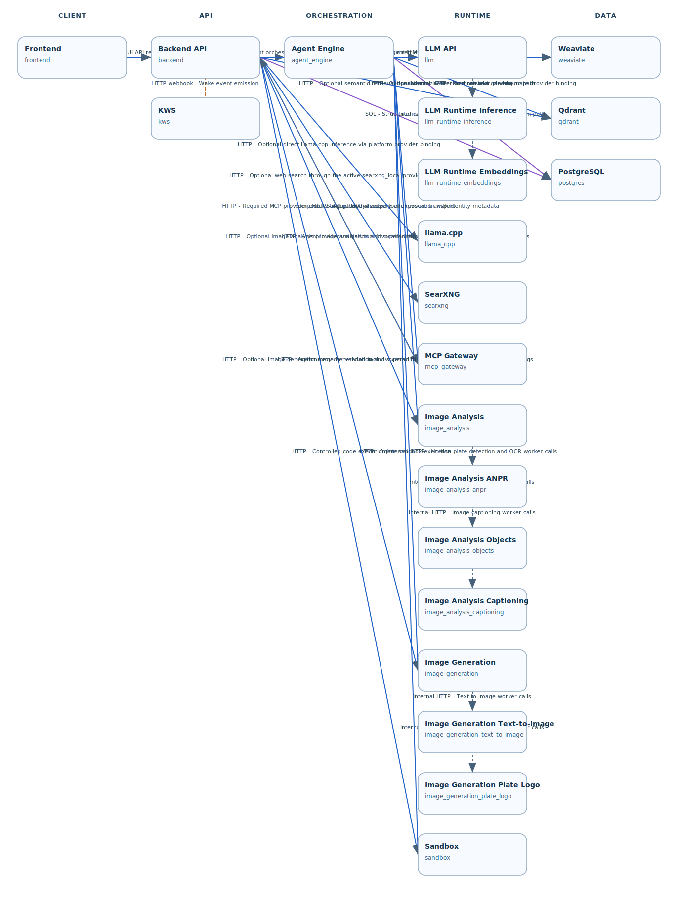

# Architecture

VANESSA is designed as a multi-container system with clear boundaries.

## System Diagram



The diagram is generated from:

- `infra/docker-compose.yml` (service inventory and dependencies)
- `infra/architecture/metadata.yml` (labels, groups, communication semantics)

To regenerate artifacts:

```bash
python scripts/generate_architecture.py --write
```

Legend:

- Solid blue edges: HTTP calls
- Purple edges: SQL/data access
- Dashed orange edges: event/webhook flow
- Dashed gray edges: internal runtime/dependency links

## Container Boundaries

1. Frontend: browser UI, HTTP calls only to backend API.
2. Backend (Flask API): public API entrypoint, validation, orchestration.
3. LLM API: private model-serving HTTP gateway for inference/discovery requests.
4. LLM Runtime: hardware-adaptive local vLLM runtime engine backing LLM API execution on CPU or GPU hosts.
5. Agent Engine: multi-step agent logic and tool workflows.
6. Sandbox: isolated Python code execution environment.
7. KWS: offline wake-word detection and wake-event emission.
8. Weaviate: persistent semantic index for RAG context retrieval.
9. PostgreSQL: persistent relational data for auth and metadata.

Interaction semantics in the generated graph represent directional runtime communication paths (who calls whom), not Docker Compose startup dependencies:

- Frontend -> Backend API
- Backend API -> Agent Engine, LLM API, Sandbox, Weaviate, PostgreSQL
- Agent Engine -> LLM API, Sandbox, Weaviate, PostgreSQL
- LLM API -> LLM Runtime
- KWS -> Backend API

## Design Principles

- Keep agent logic in `agent_engine/`, not in Flask route handlers.
- Use service abstractions for LLM, vector store, and data access.
- Preserve sandbox isolation. Do not bypass it from backend/frontend paths.
- Keep services modular so they can evolve independently.

## Source of Truth

Container responsibilities are defined in [`AGENTS.md`](https://github.com/raul-arrabales/VANESSA/blob/main/AGENTS.md).

> Owner: Core platform maintainers. Update cadence: whenever service responsibilities or interfaces change.
